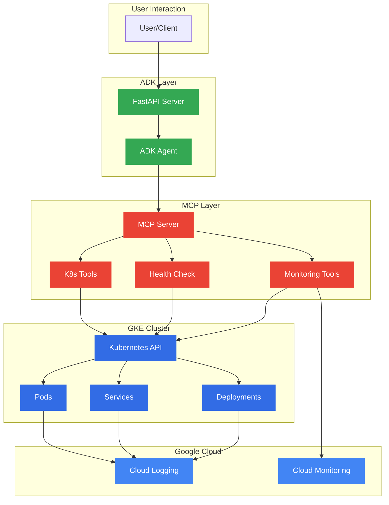

# Kubernetes Management & GKE Monitoring MCP Server

*Created for GKE Turns 10 Hackathon* #GKETurns10 #GKEHackathon

## Project Overview

The GKE Intelligent Monitoring System is an advanced monitoring and management solution that combines the power of Google Kubernetes Engine (GKE) with AI-driven insights using Google's AI Development Kit (ADK) and Model Context Protocol (MCP). This system provides intelligent monitoring, automated troubleshooting, and proactive management capabilities for GKE clusters.

## Features

- **Intelligent Cluster Monitoring**
  - Real-time monitoring of GKE cluster health
  - Pod lifecycle management and status tracking
  - Service and deployment monitoring
  - Resource utilization insights

- **AI-Powered Troubleshooting**
  - Automated problem detection and diagnosis
  - Intelligent remediation suggestions
  - Predictive analytics for potential issues
  - Network connectivity analysis

- **Advanced Management Capabilities**
  - Dynamic scaling of deployments
  - YAML manifest management
  - Pod execution and log analysis
  - Security context management

- **Integration Capabilities**
  - Seamless integration with GKE clusters
  - Support for Prometheus metrics
  - Cloud Monitoring integration
  - Custom tooling support through MCP

- **Core tools**
  - Discoverable tool catalog via `GET /tools` on the MCP server.
  - Tool proxy endpoints `POST /tool/<name>` accepting JSON `{ "args": [...], "kwargs": {...} }` and returning `{ "ok": true, "result": ... }` or `{ "ok": false, "error": "..." }`.
 - Core tools included:
  - `get_cluster_info` - Get basic cluster information, node status, and health
  - `list_pods` - List pods with status, resource usage, and readiness
  - `get_pod_logs` - Retrieve pod logs for troubleshooting
  - `describe_pod` - Get detailed pod information and events
  - `get_service_status` - Check service endpoints and networking
  - `get_deployment_status` - Monitor deployment health and replica status
  - `delete_resource` - Delete a Kubernetes resource (deployment, service, pod, etc.).
  - `suggest_troubleshooting` - AI-powered troubleshooting recommendations
  - `automate remediation` - Image pull remediation analysis for pod
  - `get_gke_cluster_metrics` - GKE-specific performance metrics
  - `scale deployment` - Scale a deployment to a specific number of replicas
  - `exec pod command` - Execute a command inside a pod container.
  - `network_connectivity_test` - Test network connectivity and DNS resolution

## Technologies Used

- Google Kubernetes Engine (GKE)
- Model Context Protocol (MCP) server via `mcp.server.fastmcp`
- Google ADK (`google.adk.agents.LlmAgent`) for the conversational agent
- Python 3.11, `kubernetes` Python client, `httpx`, `requests`
- Docker + Artifact Registry (or GCR) and Cloud Build for CI
- `kubectl` manifests and RBAC for in-cluster deployment

### Data Sources & External Services

- Kubernetes API (in-cluster via ServiceAccount or kubeconfig)
- Google Cloud Project metadata when configured (GCP_PROJECT_ID, cluster name/zone)
- Optional metrics-server for resource metrics (node/pod top)

## Architecture

The system consists of three main components:

1. **ADK Agent** - Handles AI-driven interactions and decision-making
2. **MCP Server** - Provides tooling and Kubernetes management capabilities
3. **GKE Integration** - Direct interface with GKE clusters and resources

## How to Build & Deploy

1. Build images (Cloud Build or docker build/push).
2. Apply RBAC and Deployment manifests: `kubectl apply -f k8s-manifests/k8s-mcp-rbac.yaml` and `k8s-manifests/k8s-mcp-deployment.yaml`.
3. Deploy ADK agent: `kubectl apply -f deployment.yaml`.
4. Monitor logs: `kubectl logs -f deployment/k8s-mcp-server` and `kubectl logs -f deployment/adk-agent`.

### Configuration

#### Environment Variables
Key environment variables:
- `GCP_PROJECT_ID` - Your Google Cloud project ID
- `GKE_CLUSTER_NAME` - Target GKE cluster name
- `GKE_ZONE` - GKE cluster zone/region
- `MCP_SERVICE_URL` - MCP server endpoint

#### AI Model Configuration
The project uses Google's ADK `LlmAgent` which internally uses the Gemini 2.0 Flash model through Vertex AI. Important points about the AI configuration:

- **Vertex AI Authentication**: The LlmAgent requires a Vertex AI API key which is NOT set through environment variables for security reasons. Instead, it should be configured through Google Cloud's secret management system.

### Deployment

The system uses Kubernetes manifests for deployment, including:
- Deployment configurations
- RBAC settings
- Service accounts
- Network policies

## Findings and Learnings

During the development of this project for the GKE Turns 10 Hackathon, several key insights were gained:

1. GKE's robust API and integration capabilities make it an ideal platform for building intelligent monitoring solutions
2. Combining ADK with Kubernetes operations enables sophisticated automation and decision-making
3. MCP provides a flexible framework for extending monitoring capabilities
4. Real-time monitoring with AI-driven insights can significantly improve cluster management

## Future Enhancements

- Enhanced predictive analytics for resource scaling
- Machine learning models for anomaly detection
- Extended automation capabilities
- Integration with additional Google Cloud services

## Contribution & Hackathon Note

This project was created and adapted for entry in the GKE Turns 10 Hackathon. Contributions and improvements are welcome. #GKEHackathon

## License

MIT License